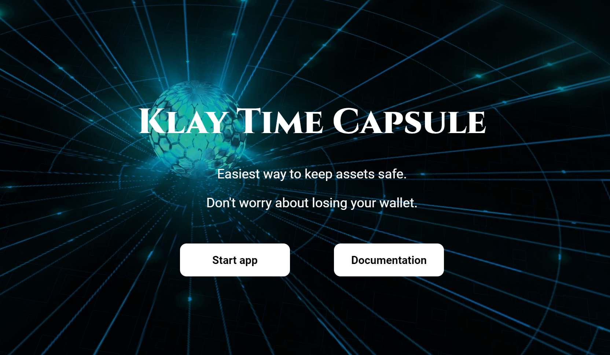
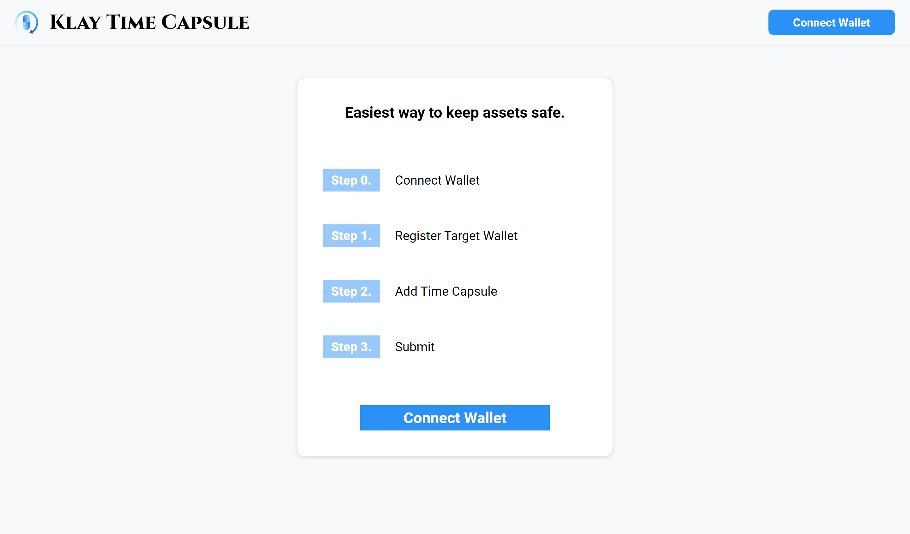
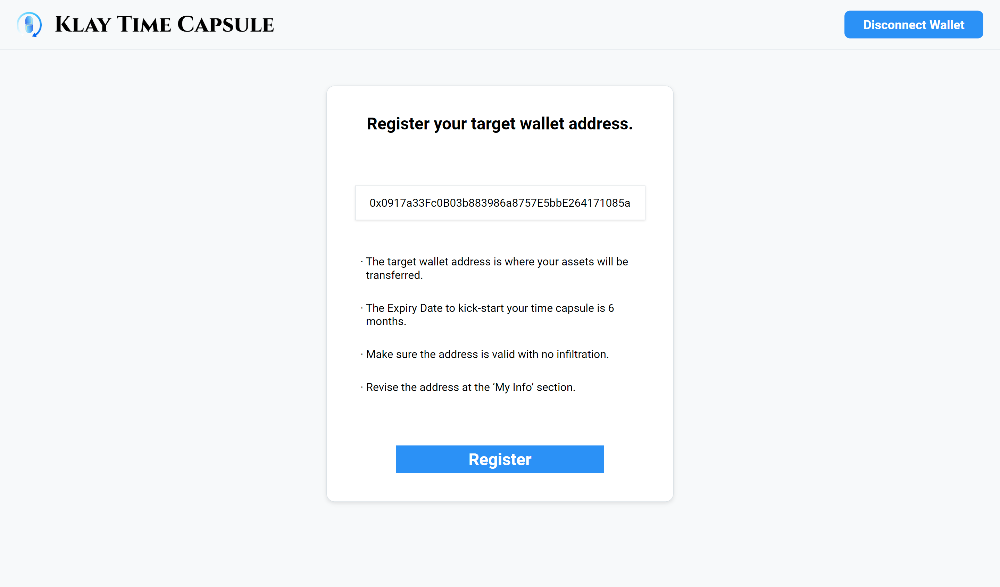
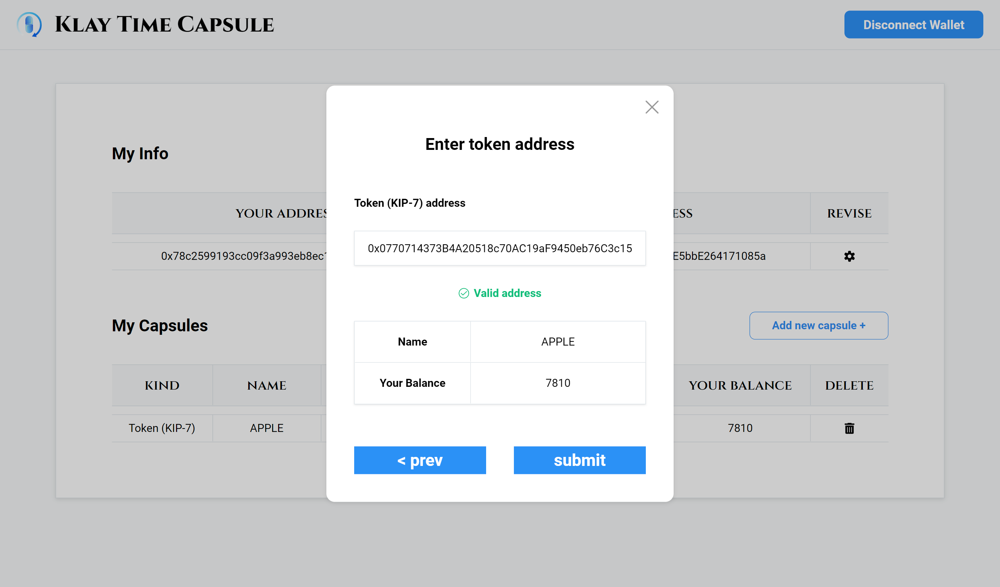
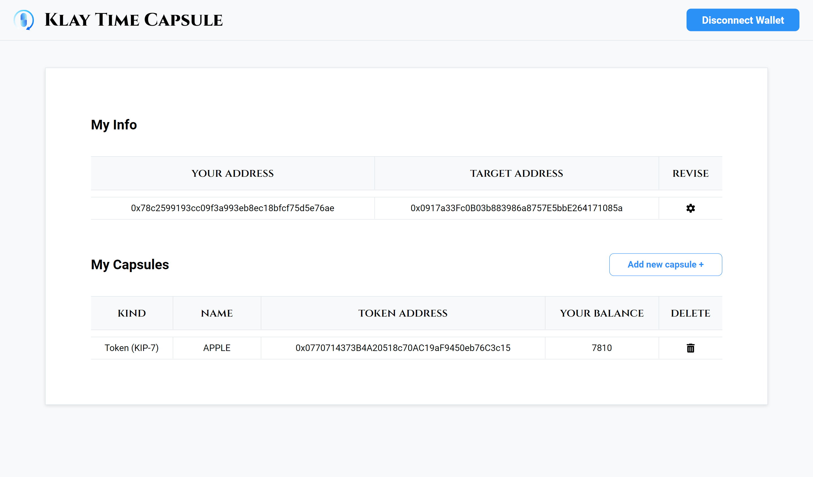
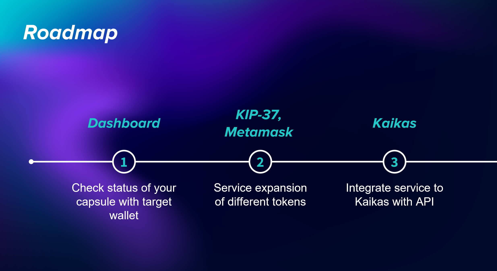

# Klay Time Capsule

<b>YOUR CRYPTO SAFEGUARD</b>. Easiest way to keep crypto assets safe. Don't worry about losing your wallet.

[https://klaytimecapsule.xyz](https://klaytimecapsule.xyz/)

  

## Inspiration

Your crypto assets need an evacuation plan. The total volume of crypto assets stored in wallets are increasing as the market grows. Meanwhile, there’s no solution to prevent loss of those assets when accidents occur(ex_Loss of private keys, sudden death etc.).

<b>Klay Time Capsule</b> resolves these concerns by providing a simple and easy way to protect your crypto assets.

## How to use

#### Step 0: Connect Wallet

  

Connect the wallet you wish to create a time capsule.

#### Step 1: Register target wallet

  

Set a Target Wallet. The target wallet address is where your assets will be transferred.

#### Step 2: Add Time Capsule

  

2-1. Click 'Add New Capsule'

2-2. Select your asset type(KIP-7 or KIP-17).

2-3. Paste the contract address of your token for verification.

#### Step 3: Submit

  

Press submit and manage the dashboard of capsules you've created. The Expiry Date to kick-start your time capsule is 6 months. All assets are automatically transferred to the target wallet if there are no transactions until the Expiry Date.

Your time capsule is ready to go!

## Roadmap

  

## How it's made

  

- react
- caver-js
- mysql

## Contract

KlayTimeCapsule: 0x930F95C882c041820d67C562Cb29C878a49215C5 (Baobab network)
